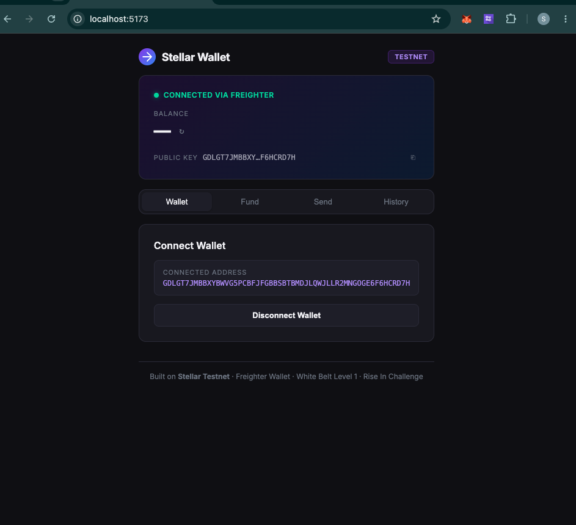
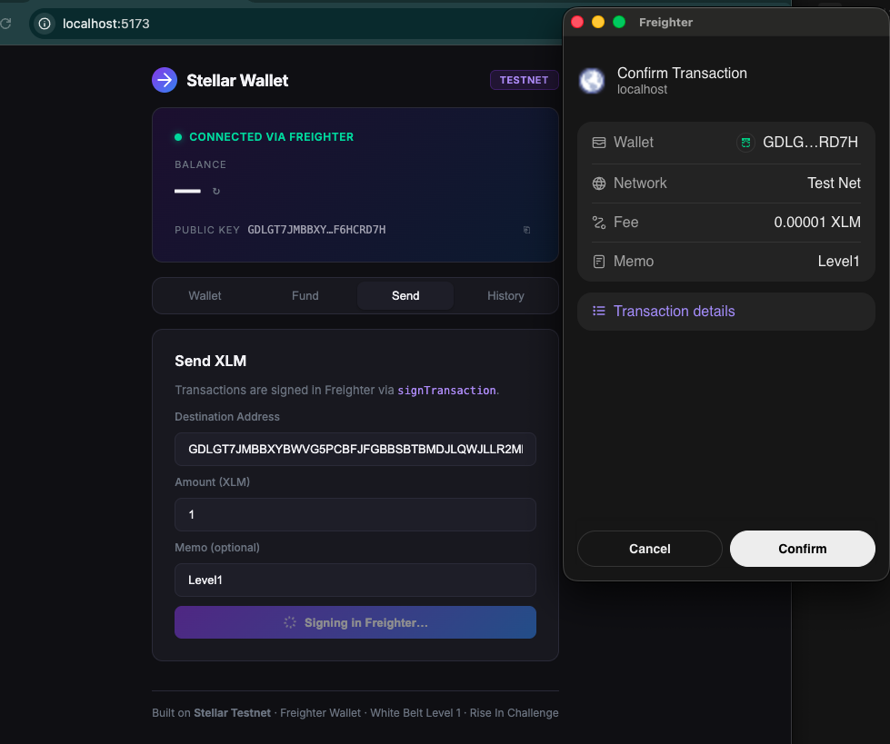
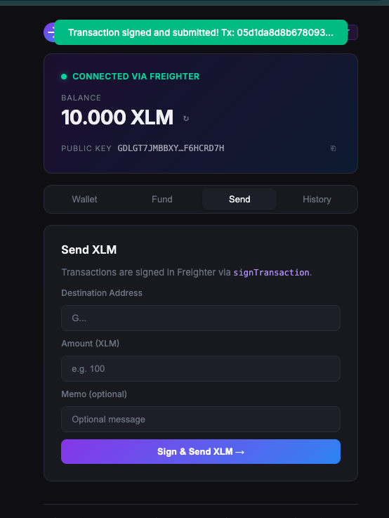

# Stellar Wallet — White Belt Level 1

A Stellar Testnet wallet built with React, the Stellar SDK, and **Freighter wallet integration**.

## Features

- **Connect Wallet** — Connect via Freighter browser extension using `setAllowed` + `getAddress`
- **Fund with Friendbot** — Activate account with 10,000 Testnet XLM
- **Check Balance** — View real-time XLM balance from Horizon
- **Send XLM** — Build payment transactions and sign them via Freighter's `signTransaction`
- **Transaction History** — View last 10 payments with explorer links

## Tech Stack

- React + Vite
- [@stellar/stellar-sdk](https://github.com/stellar/js-stellar-sdk)
- [@stellar/freighter-api](https://www.npmjs.com/package/@stellar/freighter-api)
- Stellar Horizon Testnet API
- Stellar Friendbot

## Prerequisites

1. Install the [Freighter browser extension](https://www.freighter.app/)
2. Set Freighter network to **Testnet**

## Getting Started

```bash
npm install
npm run dev
```

Open [http://localhost:5173](http://localhost:5173)

## How to Use

1. Click **Connect Wallet** — approve the app in Freighter (`setAllowed`)
2. Go to **Fund** tab → click **Fund with Friendbot** to get 10,000 XLM
3. Go to **Send** tab → enter destination and amount → approve signing in Freighter
4. Go to **History** tab to see your transactions

## Freighter Integration

| API | Usage |
|-----|-------|
| `isConnected` | Check if Freighter extension is installed |
| `setAllowed` | Request permission to connect |
| `getAddress` | Retrieve connected wallet public key |
| `signTransaction` | Sign payment transactions before submission |

## Network

All transactions run on **Stellar Testnet** — no real funds involved.

## Screenshots

### Wallet Connected via Freighter


### Transaction Signing in Freighter (`signTransaction`)


### Balance Displayed & Successful Testnet Transaction


---

Built for the [Rise In — Stellar Journey to Mastery](https://risein.com/programs/stellar-journey-to-mastery-monthly-builder-challenges) White Belt Level 1 challenge.
