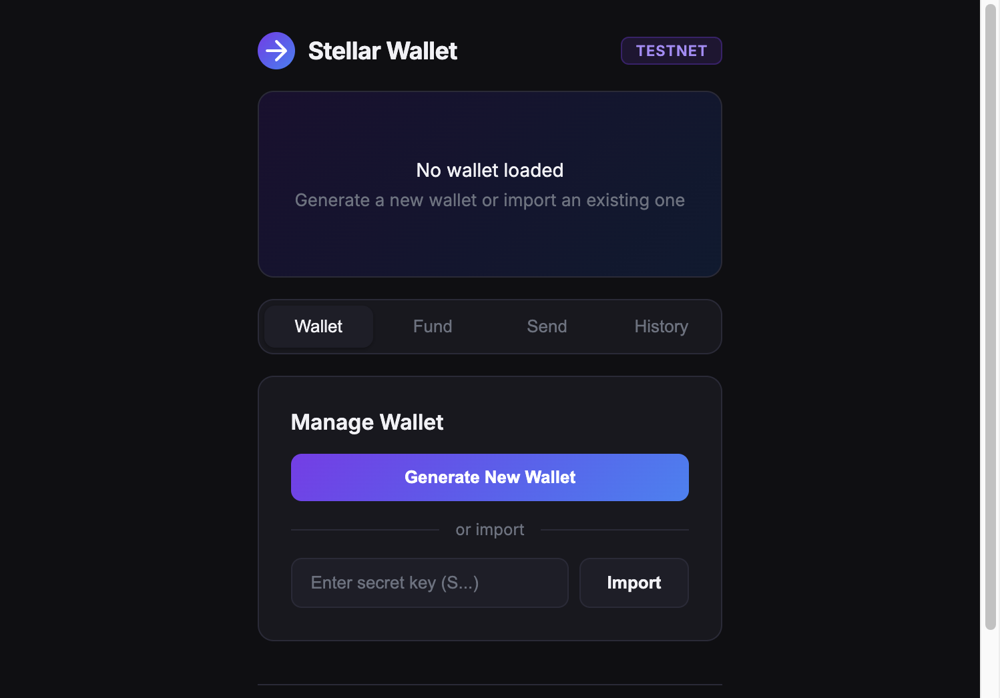
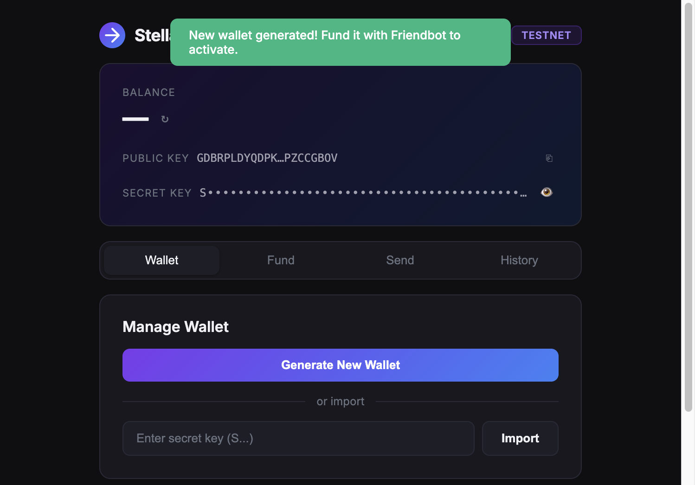
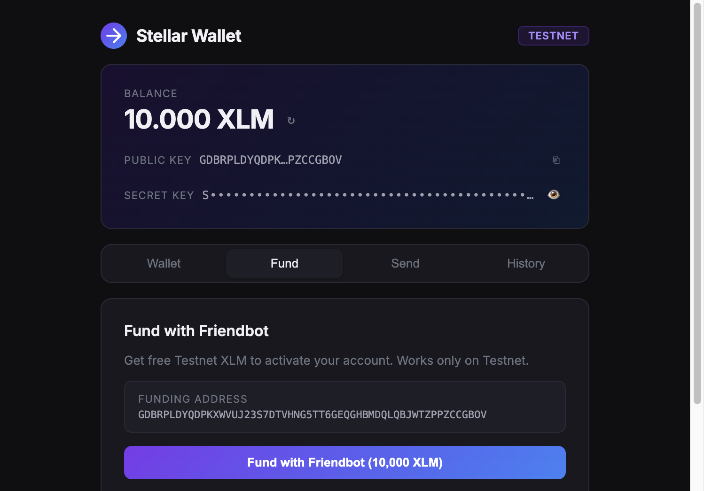
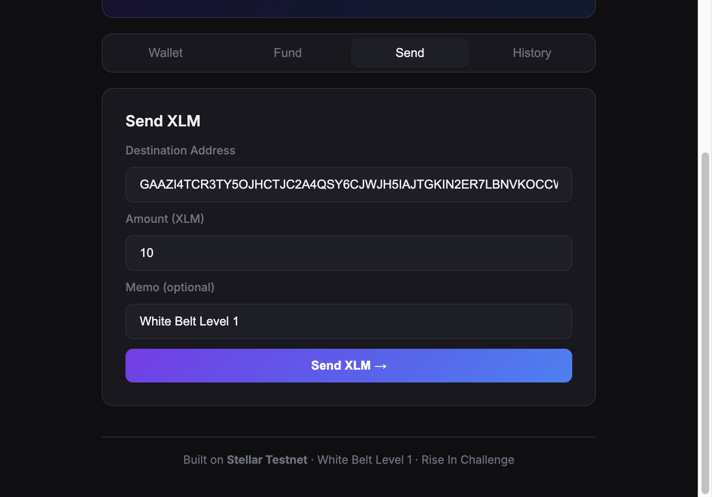
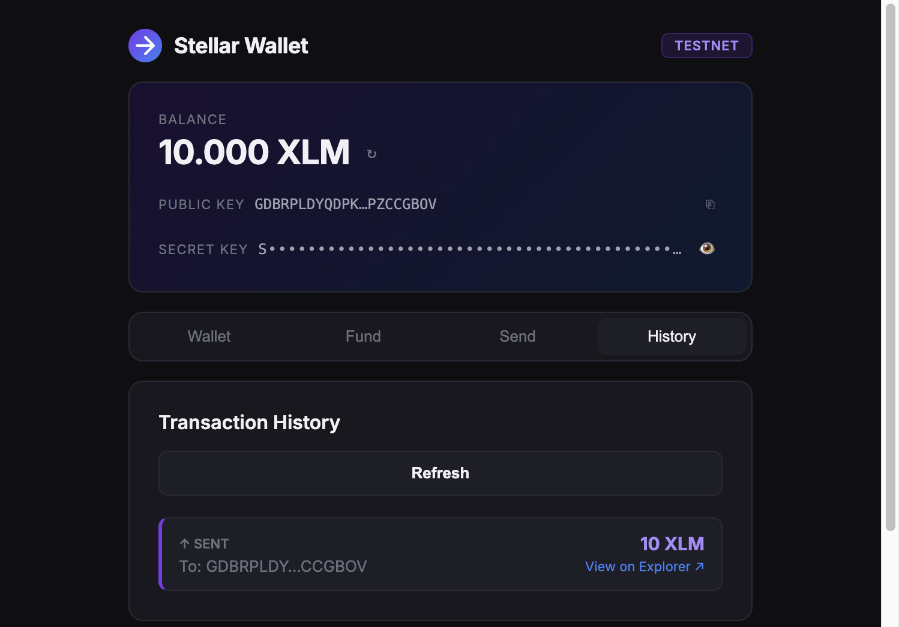

# Stellar Wallet — White Belt Level 1

A Stellar Testnet wallet built with React and the Stellar SDK.

## Features

- **Generate Wallet** — Create a new Stellar keypair (public + secret key)
- **Import Wallet** — Load an existing wallet via secret key
- **Fund with Friendbot** — Activate account with 10,000 Testnet XLM
- **Check Balance** — View real-time XLM balance
- **Send XLM** — Transfer XLM to any Stellar Testnet address with optional memo
- **Transaction History** — View last 10 payments with explorer links

## Tech Stack

- React + Vite
- [@stellar/stellar-sdk](https://github.com/stellar/js-stellar-sdk)
- Stellar Horizon Testnet API
- Stellar Friendbot

## Getting Started

```bash
npm install
npm run dev
```

Open [http://localhost:5173](http://localhost:5173)

## How to Use

1. Click **Generate New Wallet** to create a keypair
2. Go to **Fund** tab → click **Fund with Friendbot** to get 10,000 XLM
3. Go to **Send** tab → enter a destination address and amount, click Send
4. Go to **History** tab to see your transactions

## Network

All transactions run on **Stellar Testnet** — no real funds involved.

## Screenshots

### Home Screen


### Wallet Connected (keypair generated)


### Balance Displayed (after Friendbot funding)


### Send XLM Transaction Form


### Transaction Result — History with successful on-chain payment


---

Built for the [Rise In — Stellar Journey to Mastery](https://risein.com/programs/stellar-journey-to-mastery-monthly-builder-challenges) White Belt Level 1 challenge.
